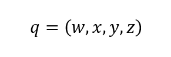

# Quaternions

If brief, quaternions are hypercomplex numbers with one real component and three
complex components. Quaternions can be represented with formulas:

Where *q* is a quaternion, *w*, *x*, *y* and *z* are real numbers and *i*, *j*
and *k* are imaginary units.

Quaternions can be represented with several ways. For example, a quaternion can
be represented as a tuple of four real numbers:

In that case a quaternion reminds a four-dimensional vector. And quaternions do
have many similar features as four-dimensional vectors do. For example:

* summation and subtraction of quaternions are same as for four-dimensional
vectors;
* multiplication and division of a quaternion at a real number are same
as for a four-dimensional vector;
* modulus of a quaternion is calculated the same way as for four-dimensional
vector.

But the product of two quaternions is comletely different than the dot product
of two four-dimensional vectors.

Another way to represent a quaternion is a pair of a real number and
a three-dimensional vector:

Quaternions have many interesting features. In geometry, quaternions are used
to represent and combine rotations in three-dimensional Euclidean space.

Usually quaternions with unit modulus are used to represent rotations. Such
quaterions are named as [versors](./versor-eng.md).

## Implementation of quaternions in the library

There are two varians of implementation of quaternions in the library:
* quaternions
* versors

The main difference implementation of quaternions and versors is that
the versors are designed for representation of rotations in
the three-dimensional Euclidean space while quaternions are implemented in
a more general sense.

Versors are not possible to add and subtract. Versors cannot be mutiplied
or divided with a real number. But quaternions can be added and subtracted,
multiplied and divided with a number.

Versors can be combined. It is the same operation as multiplication of
two quaternions but the function of combination of two versors watches that
the resulting versor has modulus equal to 1.

All the functions which change the state of a versor keep the modulus of
a versor close to 1.

Yes, the modulus of a versor is very close to 1 because floating point numbers
are not perfect and have little aberrations. Thus the modulus is not always
equal to 1 but very close to 1.

There two structural types for quaternions:

    typedef struct {
        float s0, x1, x2, x3;
    } BgcQuaternionFP32;

    typedef struct {
        double s0, x1, x2, x3;
    } BgcQuaternionFP64;

And there are two strucutral types for versors:

    typedef struct {
        const float s0, x1, x2, x3;
    } BgcVersorFP32;

    typedef struct {
        const double s0, x1, x2, x3;
    } BgcVersorFP64;

As you can see there is a difference in the definision of quaternions and
versors: the fields of versors are const while the fields of quaternions
are not const.

This was done intensionally to make a developer to use special functions for
versors to set the state of a versor instead of direct setting of
the field values because versor functions keep the modulus of a versor equal
to 1.

At the same time a developer can read the fields of a versor for their own
needs, for example, for some computations or for saving a versor in a file
or for passing it via a computer network.

