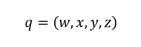
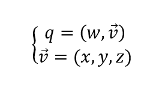

# Кватернионы

Кватернионы - это гиперкомплексные числа, у которых имеется одна действительная
компонента и три комплексных компоненты:

Где *q* - это кватернион, *w*, *x*, *y* и *z* - это действительные числа, а *i*,
*j* и *k* - это мнимые единицы.

Кватернион можно представлять по-разному, например, в виде кортежа
(последовательности) из четырёх чисел:

В такой форме кватернион напоминает четырёхмерный вектор. И кватернионы
действительно имеют ряд сходств с четрырёхмерными векторами, например:

* сложение и вычитание кватернионов такие же, как и у четырёхмерных векторов;
* умножение и деление кватериона на действительное число такие же как и для
четырёхмерного вектора;
* взятие модуля кватерниона вычисляется также как и для четырёхмерного вектора.

Но произведение кватернионов совершенно иное, чем скалярное произведение двух
четырёхмерных векторов.

Ещё одним способом представления кватерниона является пара из действительного
числа и трёхмерного вектора:

Кватернионы обладают массой интересных свойств и применений. В геометрии
основным применением является описание поворотов в трёхмерном евклидовом
пространстве.

Обычно для представления поворотов используются кватернионы с модулем, равным
единице. Такие кватернионы называются [версорами](./versor-rus.md).

## Реализация кватернионов в библиотеке

В библиотеке кватернионы реализованы в двух вариантах:
* в виде обычных кватернионов
* в виде веросоров

Главное отличие в реализации кватернионов и версоров том, что реализация
версоров ориентирована именно для представления поворотов в трёхмерном
евклидовом пространстве пространстве, в то время как кватернионы имеют более
общую реализацию.

Версоры нельзя складывать, вычитать. Также версоры нельзя умножать и делить на
вещественные числа. Но кватернионы можно складывать, вычитать, а также умножать
и делить на вещественное число.

Версоры можно комбинировать. Операция комбинирования версоров является обычным
произведением кватернионов. Единственное отличие в том, что операция
комбинирования версоров обеспечивает, чтобы результат комбинации также имел
модуль, равный единицы.

Все функции версоров, которые менияют состояние версора, обеспечивают, чтобы
модуль версора оставался близким к единице.

Да, модуль версора очень близок к единице, потому что числа с плавающей запятой
не совершенны и имеют небольшие погрешности. Поэтому модуль не всегда равен
единице, но очень близок к единице.

Для описаия кватернионов есть две структуры:

    typedef struct {
        float s0, x1, x2, x3;
    } BgcQuaternionFP32;

    typedef struct {
        double s0, x1, x2, x3;
    } BgcQuaternionFP64;

Для описания версоров также имеется две структуры:

    typedef struct {
        const float s0, x1, x2, x3;
    } BgcVersorFP32;

    typedef struct {
        const double s0, x1, x2, x3;
    } BgcVersorFP64;

Уже в определении структур можно заметить разницу между в реализации
кватернионов и версоров: поля версоров объявлены как константы, в то время как
поля кватерниона не являются константами.

Это сделано намеренно, чтобы побудить разработчика использовать функции для
версоров, вместо того, чтобы задавать значения полей напрямую, потому что
функции версоров обеспечивают, чтобы модуль версора был равен единице.

В то же время, разработчик может обращаться к полям версора, чтобы получить
значения этих полей для своих целей, например, чтобы сделать какие-либо
вычисления или  сохранить состояние версора в файле, или передать версор через
подключение по компьютерной сети.

