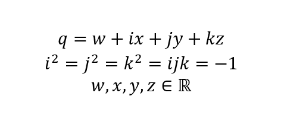
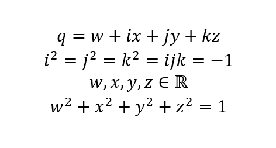

# Versors

[Quaternions](./quaternion-eng.md) are complex numbers which have one real component and three imaginary components.

Quaternions were discovered by mathematician William Hamilton and introduced to the public in 1843.

In the same way, William Hamilton proposed a special class of quaternions, which he called versors.

A versor is a quaternion whose modulus is equal to one. That is, the formulas defining quaternions must be supplemented with the condition that the modulus of a quaternion is equal to one.

The name comes from the Latin verb "versare", meaning "to turn", "to rotate", to which is added the Latin ending -or, which denotes the subject performing the action.

Literally, the Latin word "versor" can be translated as "rotator" or "turner".

Versors turned out to be a pretty good tool for describing rotations in three-dimensional space.

For the combination of two consecutive rotations, the operation of multiplying quaternions has proven useful, and for obtaining the inverse rotation, the operation of obtaining the conjugate quaternion.

When multiplying two versors (quaternions of unit length) and taking the conjugate versor, the result will also be a versor, that is, a quaternion of unit length.

Addition and subtraction of two quaternions, as well as multiplication and division of a quaternion by a number, turned out to be unnecessary for describing rotations in three-dimensional space.

## Advantages of versors over quaternions

The main advantage of isolating versors as a separate abstraction from quaternions is that versors retain a modulus equal to one, i.e., versors do not degenerate.

Quaternions whose modulus is not equal to one can, as a result of many multiplication operations, yield a quaternion whose modulus can be so close to zero that it will be comparable to the magnitude of the error.

In practice, the versor module is not always equal to one, but is close to one due to the presence of the **float** and **double** (**binary32** and **binary64**) error types. But the BGC library functions ensure that the modulus of the vertex obtained as a result of some operation does not deviate from unity by an amount not exceeding a specified error.

And this is the second advantage of using versors to describe rotations. The developer who uses the library does not need to perform normalization, as would have to be done with ordinary quaternions.

But the library functions do not always perform versor normalization, but only when necessary. The library functions normalize the resulting versor only when the versor module deviates from unity by more than a predetermined error value (epsilon).

In most cases, when the input parameters are versors (normalized quaternions), the magnitude of the resulting versor also does not deviate much from one, and therefore there is no need to perform normalization. Thus, time-consuming operations such as calculating square roots and division can be avoided. This approach improves performance and keeps versors normalized.

## Implementation of versors in the library

The library has a separate implementation for versors in the form of special structures and a set of functions that support the versor module close to one, since it is necessary to support the versor module close to one, and versors do not need addition and subtraction, as well as multiplication and division by a number.

There are two structures for describing a versor:

    typedef struct {
        const float s0, x1, x2, x3;
    } BgcVersorFP32;

    typedef struct {
        const double s0, x1, x2, x3;
    } BgcVersorFP64;

The field **s0** is the real part of the versor (normalized quaternion), and the fields **x1**, **x2**, and **x3** are the imaginary components of the versor.

The fields of the structures are intentionally declared as const to encourage the developer to use functions for working with versors, instead of directly setting the field values. The functions responsible for operations on versors maintain the module of the obtained versors equal to one.

With these structures, it is better to use special functions that allow setting new values ​​in the fields of the **BgcVersorFP32** and **BgcVersorFP64** structures.

## Operation with versors

- [Reset state](./versor-reset-eng.md)
- [Specify component values](./versor-set-values-eng.md)
- Copy component values
- Swap component values
- Build based on rotation
- Check for absence of rotation
- Type conversion
- Rotation reduction
- Inversion
- Combination
- Get rotation description
- Get rotation matrix
- Get inverse rotation matrix
- Rotate vector
- Inverse vector rotation
- Compare
