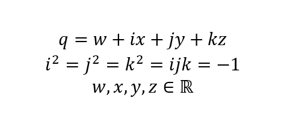
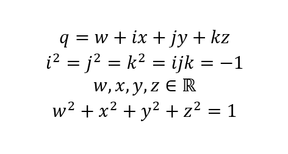

# Версоры

[Кватернионы](./quaternion-rus.md) - это гиперкомплексные числа, у которых имеется одна действительная
компонента и три комплексных компоненты:

Кватернион имеет четыре степени свободы. Но если ввести ограничение в виде
требования, чтобы модуль этого кватерниона был равен единице, то такое множество
кватернионов будет иметь только три степени свободы.

Эти кватернионы представляют собой сферу радиуса 1 в четырёхмерном пространстве.
"Поверхность" этой сферы имеет размерность равную трём.

Кватернионы единичной длины очень хорошо описывают повороты в трёхмерном
пространстве. Вращения в трёхмерном пространстве имеют три степени свободы,
что совпадает с размерностю поверхности сферы в четырёхмерном пространстве.

Для кватерниона единичной длины существует специальное название: **версор**.

**Версоры** - это кватернионы единичной длины. К определению кватерниона
необходимо просто добавить одно уравнение:

## Версоры в библиотеке

Библиотека имеет отдельную реализацию для версоров в виде специальных структур и
набора функций, которые поддерживают модуль версоров близким к единице.

Для описания версора имеется две структуры:

    typedef struct {
        const float s0, x1, x2, x3;
    } BgcVersorFP32;

    typedef struct {
        const double s0, x1, x2, x3;
    } BgcVersorFP64;

Поля структур намеренно объявлены констрантными (const), чтобы побудить
разработчика использовать функции работы с версорами, вместо того, чтобы
непосредственно задавать значения полей. Функции работы с версорами поддерживают
модуль версора равным единицы.

С данными структурами лучше использовать специальные функции, которые позволяют
устанавливать новые значения в поля структур **BgcVersorFP32** и
**BgcVersorFP64**.

